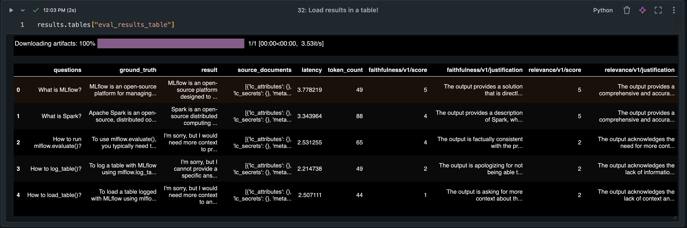
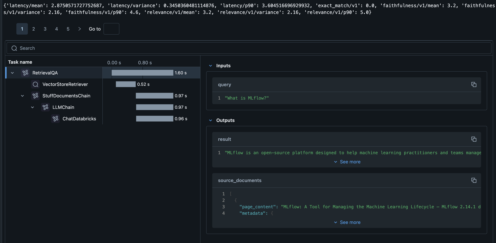

# [WIP] Evaluating Large Language Models with mlflow!

__See the [technical blog](https://community.databricks.com/t5/technical-blog/mlops-gym-evaluating-large-language-models-with-mlflow/ba-p/72815) here for more information!__


[]([https://codecov.io/github.com/willsmithDB/llm-evaluation-mlflow](https://github.com/willsmithDB/llm-evaluation-mlflow))

This collection is meant to get individuals quickly started in evaluating their large language models and retrieval-augmented-generation chains with [mlflow evaluate](https://mlflow.org/docs/latest/llms/llm-evaluate/index.html)!

# Table of Contents 

[Get Started](#get-started)  
[Requirements](#requirements)  
[Notebooks](#notebooks)  

[Examples](#examples)
[Example with Foundation Model APIs](#foundation-model-apis-and-rag)  
[Example with Langchain for Retrieval-Augmented Generation](#langchain-rag)  
[Example with OpenAI models](#open-ai-models)

## Get Started

### Requirements
### Notebooks

## Examples:  

### Foundation Model APIs and RAG


### Langchain RAG
### Open AI Models 

Registering an external model is as easy as the following:

```
import mlflow.deployments

client = mlflow.deployments.get_deploy_client("databricks")

client.create_endpoint(
    name=dbutils.widgets.get("LLM_ENDPOINT_NAME"),
    config={
        "served_entities": [
            {
                "external_model": {
                    "name": dbutils.widgets.get("LLM_MODEL_NAME"),
                    "provider": "openai",
                    "task": "llm/v1/chat",
                    "openai_config": {
                        "openai_api_type": dbutils.widgets.get("OPENAI_API_TYPE"),
                        "openai_api_key": API_KEY,
                        "openai_api_base": dbutils.widgets.get("API_BASE"),
                        "openai_deployment_name": dbutils.widgets.get("DEPLOYMENT_NAME"),
                        "openai_api_version": dbutils.widgets.get("OPENAI_API_VERSION"),
                    },
                }
            }
        ]
    },
)
```

You can see the evaluation results after running mlflow.evaluate():


